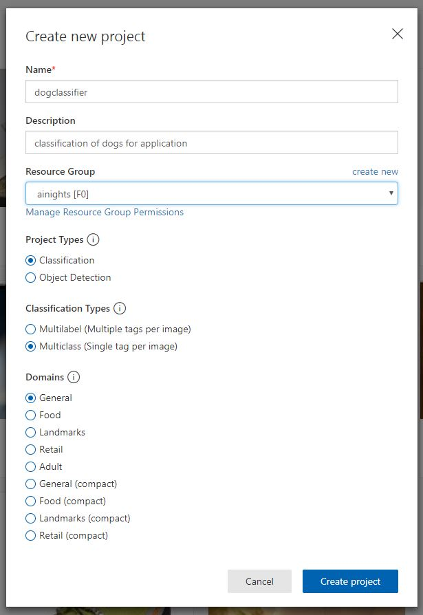
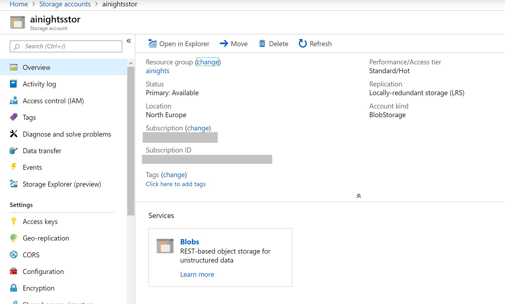
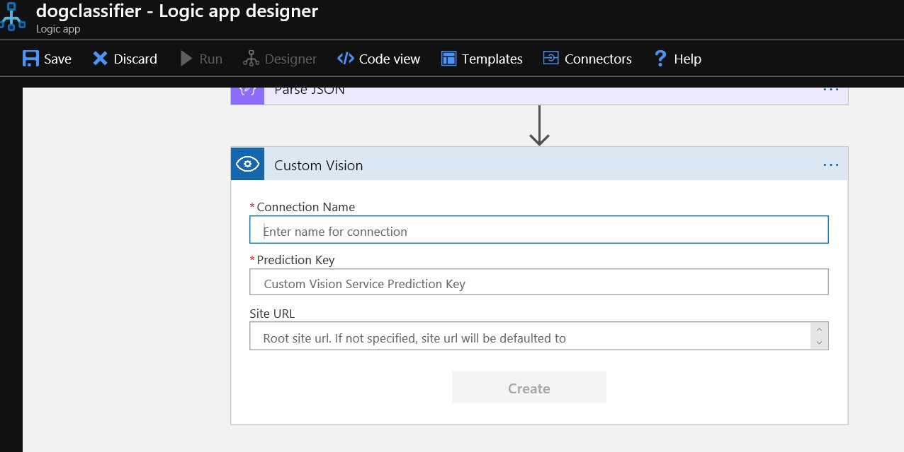
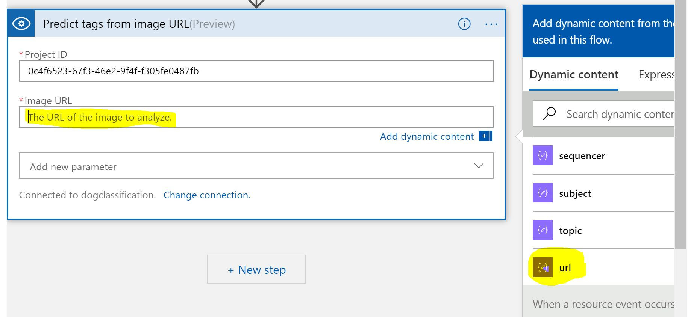
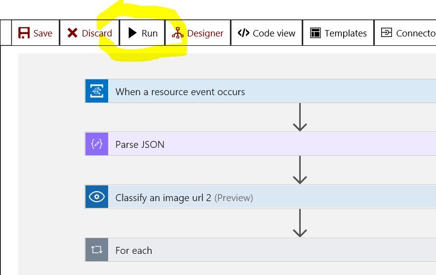
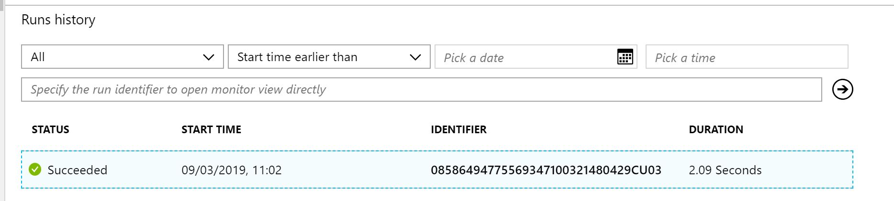
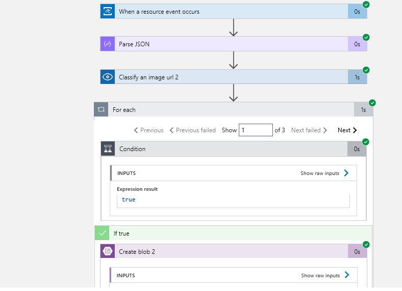

# AI Nights Content - Beginner Track

## For Session Owners - Train the Trainer

This GitHub repository is provided for **session owners** to access and learn content that can be delivered at **AI Nights** across the globe in **April and September**. This content is designed for the **Beginner Track** and is approx **1 hours worth** of content ([This can be followed by the Azure Machine Learning Service Visual Interface content](https://github.com/GlobalAICommunity/GlobalAINight-September-2019#part-2---is-that-wine-good-or-bad-a-beginner-tutorial-on-how-to-build-a-binary-classification-machine-learning-model-with-no-code-using-azure-machine-learning-visual-interface-1-hour)). Some elements of the workshops are for the speakers to demo and other elements are for attendees to complete on their own devices and with their own Azure Subscription. Please find the public workshop content for attendees here:  [https://github.com/amynic/AINights](https://github.com/amynic/AINights)

## Session Information

**Session Title:** Creating applications that can see, hear, speak or understand - using Microsoft Cognitive Services

**Session Abstract:** In this workshop you will be introduced to the [Microsoft Azure Cognitive Services](https://azure.microsoft.com/en-gb/services/cognitive-services/?WT.mc_id=ainights-github-amynic), a range of offerings you can use to infuse intelligence and machine learning into your applications without needing to build the code from scratch.
We will cover pre-trained AI APIs, such as [computer vision](https://azure.microsoft.com/en-gb/services/cognitive-services/directory/vision/?WT.mc_id=ainights-github-amynic) and [text analytics](https://azure.microsoft.com/en-gb/services/cognitive-services/directory/lang/?WT.mc_id=ainights-github-amynic), that are accessed by REST protocol. nEXT we will dive into Custom AI that uses transfer learning - [Microsoft Azure Custom Vision](https://azure.microsoft.com/en-gb/services/cognitive-services/custom-vision-service/?WT.mc_id=ainights-github-amynic). This enables you to provide a small amount of your own data to train an image classification model. Wrapping the workshop up by building our custom trained AI into an application - using [Logic Apps](https://azure.microsoft.com/en-gb/services/logic-apps/?WT.mc_id=ainights-github-amynic), this technology is ideal for building data pipeline processes that work with your machine learning models.

**PowerPoint Slides available here:** [Creating applications that can see, hear, speak or understand - using Microsoft Cognitive Services](ai-nights-beginner.pptx)

> When you see **[BONUS SECTION]** in this content it means it is not designed for the 1 hour slot for the Cognitive Services within the beginner track, however if you wish to customise your session or learn about other parts of the Cognitive services you can us this content

## Pre-requisites for your machine

* Clone this repository to your local machine to gain images and code samples you need for the demos: ```git clone https://github.com/amynic/ainights-sessionowners.git```
If you plan to clone other Global AI Night workshops in the same folder, please use the following command to distinguish them since most have similar root directory names
```git clone https://github.com/amynic/ainights-sessionowners.git BeginnerCognitiveServices```
* [Microsoft Azure Subscription](https://azure.microsoft.com/en-gb/free/?WT.mc_id=ainights-github-amynic)
* Laptop with a modern web browser (Google Chrome, Microsoft Edge)
* [Postman, API Development Environment - available on Windows, Linux and macOS](https://www.getpostman.com/downloads/) To ensure WiFi at the venue is not throttled, attendees can be informed to have this pre installed before arriving at the venue
* **[BONUS SECTION]** [Download docker for your local machine - available on Windows, Linux and macOS](https://docs.docker.com/docker-for-windows/)

> *All demos and content have been tested on a Windows PC, however all options should run from macOS and Linux machines as well. Please provide information via an issue or pull request if you have feedback on other operating systems*  

## Session Timings

* **6 min** - Introduction to AI and resources needed
* **11 mins** - Computer Vision + Text Analytics API *(demonstration by speaker only)* [Go to Section](#microsoft-azure-cognitive-services---computer-vision-and-text-analytics)
* **18 mins** - Custom models using Transfer Learning - Classification + Object Detection *(attendees - try it yourself)* [Go to Section](#microsoft-azure-cognitive-services---custom-vision-demo)
* **23 mins** - Build this sample into an app using Logic apps *(attendees - try it yourself)* [Go to Section](#build-custom-ai-into-an-application---azure-logic-apps)
* **2 mins** - Useful links to share and finish

## Content Walk-through

## Microsoft Azure Cognitive Services - Computer Vision and Text Analytics

First show the Microsoft Azure Cognitive Services in their simplest format - within the web browser.
**Navigate to [https://azure.microsoft.com/en-gb/services/cognitive-services/](https://azure.microsoft.com/en-gb/services/cognitive-services/?WT.mc_id=ainights-github-amynic)**

To ensure fluidity in your presentation, you can have the page opened in your browser before your session beginsand type in **Azure Cognitive Services** in the search box; it will usually be the first result displayed.

Talk through the options from Vision, Speech, Language, Knowledge and Search very briefly

Select **Vision** to navigate to: [https://azure.microsoft.com/en-gb/services/cognitive-services/directory/vision/](https://azure.microsoft.com/en-gb/services/cognitive-services/directory/vision/?WT.mc_id=ainights-github-amynic)


Talk through the Vision options very briefly (Scene and Activity Recognition in Images, OCR, Face Detection, Emotion Detection, Video indexer etc)

Select the **Demo** link next to **Scene and activity recognition in images** under **Computer Vision**

Talk through example image shown by default. The ability to scroll through the JSON response and pick out the objects it found, the tags it assigned and description provided for example.


Now select **Browse** button and upload the **cat.jpeg** image from ```sample-images/computer-vision-web-browser/cat.jpeg```


EXTRA: Also, select **Browse** button and upload the **city.jpeg** image from ```sample-images/computer-vision-web-browser/city.jpeg```


Now show examples of the Text Analytics API but using the REST protocol as you would use to integrate these services into an application

First log into Microsoft Azure to create a Cognitive Services account.

Select **Create a resource** and search **Cognitive Services** and choose Enter. Then select **Create** on the Cognitive Services blade


Enter details to create an account:

* **Name:** enter a suitable name for the service (example: ainightscognitive)
* **Subscription:** Choose a relevant subscription
* **Location:** Choose your closest Data Center available
* **Pricing Tier:** S0
* **Resource Group:** Create new, and provide a sensible name (example ainights)
* **select the checkbox after reading the terms below**
* **select 'Create'**


Once created, in your notifications select **go to resource**


In the Cognitive Services blade, select **Keys** and copy **KEY 1**


Now select **Overview** and copy the **Endpoint** variable


Open Postman, API Development environment on your local machine.
> Find the download in the [Pre-requisites section](#Pre-requisites-for-your-machine)

Select Create a Request


Enter request details and create a new collection


Select the newly created collection and choose save


Now create a request to call your text analytics API:

* Change from a GET request to a POST request in the top left
* Enter your endpoint URL and add ```text/analytics/v2.0/sentiment``` to the end
* Select Headers underneath the URL box
* In Key type ```Ocp-Apim-Subscription-Key``` and in Value add your KEY1 value
* In Key type ```Content-Type``` and in Value type ```application/json```
* 
* Select Body underneath the URL box
* Select ```raw``` from the radio button options
* Copy JSON sample from ```sample-code/text-analytics-demo/sentiment-analysis-text.json``` into the box
* Select the ```Send``` button and review the Response
* 

You can also try other options from the REST API - such as KeyPhrases function. Change the end of the URL from sentiment to keyPhrases and select send to view the key phrases for the example text.

* 

> Check out the language support for the Text Analytics API [here](https://docs.microsoft.com/en-gb/azure/cognitive-services/text-analytics/language-support/?WT.mc_id=ainights-github-amynic). If your language is supported please edit the JSON file to translate the text and show the functionality of the API above. There is an example of a French JSON file in ```sample-code/text-analytics-demo/sentiment-analysis-text-fr.json``` please edit this file as appropriate
> If you have any issues running Postman, API Development Environment you can always run the REST API requests within the API docs for [sentiment analysis](https://northeurope.dev.cognitive.microsoft.com/docs/services/TextAnalytics.V2.0/operations/56f30ceeeda5650db055a3c9/?WT.mc_id=ainights-github-amynic) and [key phrase extraction](https://northeurope.dev.cognitive.microsoft.com/docs/services/TextAnalytics.V2.0/operations/56f30ceeeda5650db055a3c6/?WT.mc_id=ainights-github-amynic). Select the data centre you are using and then enter your key in the box provided along with the sample body sample used in Postman

## **[BONUS SECTION]** Microsoft Azure Cognitive Services - Text Analytics in a Container

Demo based on the Azure Documentation: [Install and run Text Analytics containers](https://docs.microsoft.com/en-us/azure/cognitive-services/text-analytics/how-tos/text-analytics-how-to-install-containers/?WT.mc_id=ainights-github-amynic)

In order to run this demo you will need Docker installed locally on your machine
[Download docker for your local machine here - available on Windows, Linux and macOS](https://docs.docker.com/docker-for-windows/)

Once the download starts you can see the information of its progress


Once installed, run Docker (on windows type docker into the start menu and select Docker Desktop)
Check the Docker Daemon is running on your machine.

In windows you can find the icon in the bottom left toolbar near the date/time


In order to run the Cognitive Services Text Analytics API locally you need to get the image for your machine. Open a command prompt within a folder on your machine (I recommend creating an AI-Nights folder if you haven't done already)

Enter the command below

```docker pull mcr.microsoft.com/azure-cognitive-services/sentiment:latest```

and the docker image should start to download to your local registry


> If you see an error similar to the below, double check your Docker Daemon is running before executing docker commands. To confirm it is running try the [Getting Started Guide from Docker Here](https://docs.docker.com/docker-for-windows/) 

Now its downloaded we want to start running the container so we can query it with text sentences and gain our sentiment scores back.

In order to run the container you will need you **Cognitive Services Endpoint** and your **API Key** from the previous section

>if you wish to prove the container is local. Disconnect from the internet now

The docker run command looks like below ([or is available here](sample-code/cognitive-containers/run-container-command.txt)). Substitute the data center and API key values and run

```docker run --rm -it -p 5000:5000 --memory 4g --cpus 1 mcr.microsoft.com/azure-cognitive-services/sentiment Eula=accept Billing=https://<datacenter-here>.api.cognitive.microsoft.com/text/analytics/v2.0 ApiKey=<key>```

The container is running on your local machine
To understand how to query the local API review the Swagger definition here: [http://localhost:5000/swagger/index.html](http://localhost:5000/swagger/index.html)


To test the API, make a new postman request:

* POST
* URL: [http://localhost:5000/text/analytics/v2.0/sentiment](http://localhost:5000/text/analytics/v2.0/sentiment)
* Headers:
  * Content-Type : application/json
  * 

* Body:
  * enter the sample JSON input from the [previous exercise](sample-code/text-analytics-demo/sentiment-analysis-text.json)
    * 

To stop the container from running when you finish, go back ot the command line and type **CTRL + C** this will show the application shutting down


## Microsoft Azure Cognitive Services - Custom Vision Demo

Using Microsoft Azure Custom Vision service you can start to build your own personalised image classification and object detection algorithms with very little code. In this exercise we will create a dog-breed classification algorithm using Dog images from the [ImageNet open dataset created by Standford University](http://vision.stanford.edu/aditya86/ImageNetDogs/)

We have 7 Classes of dogs each with 30 images (available in a .zip file [here](sample-images/dogs.zip))

* Beagle
* Bernese Mountain Dog
* Chihuahua
* Eskimo Dog (aka Husky)
* German Shepherd
* Golden Retriever
* Maltese

There is also a set of test images (not for training) in this [.zip folder](sample-images/dogs.zip).

First create a Custom Vision instance in your Azure account.

* Go to the Azure Portal.
* Click 'Create a Resource'
* Search for 'Custom Vision'
* On the description pane for Custom Vision click Create.
* Enter details to create
  * a name for the service
    * select your subscription
    * **IMP:** Ensure you only choose **SOUTH CENTRAL US** as the location.
    * Choose the S0 tier for your pricing options
    * select the resource group you created previously for this project
    * Click Create
* 

Now we can build our classifier, navigate to [https://www.customvision.ai](https://www.customvision.ai/?WT.mc_id=ainights-github-amynic) and choose sign in. Sign in with your Azure credentials account

> Accept the terms and conditions box to continue

Once loaded choose 'New Project' which opens a window to enter details

* Name: choose a suitable name
* Description: add a description of the classifier (example shown in image)
* Resource Group: choose the resource group you created your custom vision service in (example: ainights[SO])
* Project Types: Classification
* Classification Types: Multiclass (Single tag per image)
* Domains: General
* 

Choose 'Create Project' and you will land on an empty workspace like below


Now we can start adding images and assigning them tags to create our image classifier

In the top left, select 'Add images', browse for the first folder of images - Beagle - and select all 30 of the images in the folder.

Add the tag 'beagle' to the Beagle dog images and select 'Upload 30 files'


Once successful you receive a confirmation message and you should see your images are now available in the workspace


Now complete the same steps of uploading and tagging images for the other 6 dog categories in the folder. For each type of dog:

* Click add images
* Select the 30 new dog images
* Add the class label (beagle, german-shepherd, maltese etc)
* choose upload
* confirm images uploaded into the workspace

Now you should have all categories uploaded and on the left hand side you can see your dog classes and you can filter depending on type of dog image


Now you are ready to train your algorithm on the dog image data you have uploaded. Select the green 'Train' button in the top right corner and select 'Fast Training'


Once the training process is complete you will receive machine learning evaluation metrics for your model


Now we have a model we need to test the model. Choose the 'Quick Test' button in the top right *(next to the train button)* this will open a window where you can browse for a local image or enter a web URL.

Browse for an image in the test folder (images the model has not been trained on) and upload. The image will be analysed and a result returned of what dog the model thinks it is (prediction tag) and the models confidence of its result (prediction probability)


> Repeat this process for other images in the test folder to see how the model performs

If you click on the 'Predictions' tab on the top toolbar - you should see all the test images you have submitted. This section is for re-training, as you get new data you can add this to your model to improve its performance. The images are ordered by importance - the image, which if classified correctly, will add the most new information to the model is listed first. Whereas the last image might be very similar to other images already learnt by the model so this is less important to classify correctly.


To add these images to the model - select the first image, review the results the model provided and then in the 'My Tags' box enter the correct tag and click 'save and close'


This image will disappear from the  your predictions workspace and be added to the training images workspace. Once you add a few new images and tags you can re-train the model to see if there are improvements.

To use this within applications you need the prediction details. Go to the performance tab from the top bar and choose **Publish** to make your predicition API available. Next give this published iteration a name


Once complete select the **Prediction URL** button to find all the information you need to create a Postman call to your API (using both an image or an image URL)


Hint: If you are going to test for the image file, in Postman,   for the Body, please opt for Binary mode and click the Select File button to choose the image file

**Great work!** you have created your specialised dog classification model using the Azure Custom Vision Service

## Build Custom AI into an Application - Azure Logic Apps

In this section you will build an Azure Logic App to consume your Custom Vision AI dog classification application

First we need to create two Azure Storage Accounts.

Go to the azure portal and click create new resource in the top left corner. Select the section Storage and choose the first option Storage Account.


We are going to create two storage accounts:

* one for the images to be dropped into to be processed (called ainightstor)
* another for the results after processing to be uploaded to (called resultainights)

> Complete the process below **twice** so you have two storage accounts in total

On the storage account creation page enter options to setup your storage account:s

* **Subscription:** choose your subscription
* **Resource Group:** choose the resource group you have been using for this workshop (e.g. ainights)
* **Storage Account Name:** (must be unique) enter an all lowercase storage account name. *Such as ainightsstor(yourname) or resultsainights(yourname) - append your name to the end of the storage account name so you know its unique (remove the brackets)*
* **Location:** your closest data center
* **Performance:** Standard
* **Account Kind:** Blob Storage
* **Replication:** Locally-redundant storage (LRS)
* **Access Tier:** Hot

Select **Review + create**, confirm validation is passed and then select **Create**

Below picture depicts the possible configuration for the **second storage account**.


Once your deployment is complete, got to the resource and review the account settings.
Select **Blobs** to review your empty blob storage account.


We need to add a container to the storage account to store our images and results.

Select the **+ Container** button and create a name for the container
> an example for the **ainightsstor** account would be **images**
> an example for the **resultsainights** account would be **results**

For the public access level setting select **Container (anonymous read access for containers and blobs)**


> Complete the above for an image storage account and a results storage account with the same settings

Now we will create a Logic App - this will connect your image storage account to your AI classification service and put the results in your results storage account

Head to the Azure Portal Homepage. We are going to use Event Grid, a service that detects triggers in an Azure subscription (in our case, when a new blob is created in your Azure Storage account). Before we build with this - we must register it.

Got to subscriptions in the left panel, select your subscription and find Resource Providers in the left pane. Once the resource providers are listed - search "event" and select **Microsoft.EventGrid**.


If this is not already status registered, select **register** from the toolbar


Once registered with a green tick - go back to the Azure Portal Homepage. Select **Create a Resource**. Type Logic App and select the service


Create the logic app by entering some setup detail like below:

* **Name:** suitable name for the dog classification application
* **Subscription:** Choose your subscription
* **Resource Group:** (use existing e.g. ainights) select the resource group you have been working for the whole workshop
* **Location:** choose the data center closest to you
* **Log Analytics:** off

Choose **Create**


Once created, go to resource. From here we can create our logic process. Select **Logic app designer** from the left menu and then the  **When an Event Grid resource event occurs** option


Connect to Azure event grid by signing in using your Azure credentials. Please opt for default instead of Microsoft in the dropdown.


Once connected and you see a green tick, select continue.

Select the options below:

* **Subscription:** your subscription
* **Resource Type:** Microsoft.Storage.StorageAccounts
* **Resource Name:** choose your image storage account (e.g. ainightsstor)
* **Event Type Item - 1:** Microsoft.Storage.BlobCreated


Then click on **New step** button. Type **Parse JSON** and select the parse JSON operator as part of the data Data Operations category

* **Content:** select the box and from the Dynamic Content box on the right, select **Body**
* **Schema:** select this box and enter the JSON schema provided in the [logic-app-schema1 file](sample-code/logic-app-demo/logic-app-schema1.json)


Then cick on **New step** button below  . Type **custom vision** and select the **Classify an image URL (preview)** as below


Now we need to fill in the details of the custom vision process

* **Connection Name:** Please provide a suitable name for connector to Custom Vison 

* **Prediction Key:** Enter the *Prediction Key* value as shown in the **Prediction URL** tab under **Performance** heading of your Custom Vision page.

* **Site URL:** Let this remain blank.

* **Project ID:** Find the project ID from the settings logo in the top right of the Custom Vision webpage
  * 
  * **Published Name:** You can find the published name from the performance tab in the Custom Vision service
  * 
  * **Image URL:** select the input box and on the right side select URL from Parse JSON outputs
  * 

Choose next step

type **for each** and select the grey control step called for each
Once selected in the output from previous step box, select the box and from Dynamic content select **predictions** from the Classify an image 2 category


Choose **Add an action**

Search Control, select the control icon and then from the results, select **Condition**


In the Condition box, select choose a value. From Dynamic content find 'Classify an Image URL2' and then **Predictions Probability**

Set the condition to be **Predictions Probability** greater than 0.7 (as shown below)


In the **If True** box select **Add an action**

Search for Azure Blob Storage and select the icon for Create Blob

In connection name enter **results** and select your results blob storage account name from the listed options and select create


In folder path, select the folder icon, far right, and choose the container name you created that is populated

Select the Blob name field and enter: result-(then from the Dynamic content box under Classify an Image URL 2 select **id**)

Under Blob Content, select the field and in the Dynamic Content box on the right, select **see more** under the Classify an Image 2 section. Then select **Predictions Tag**, enter a colon ":" and then select **Predictions Probability**


Finally save the logic app in the top action bar

Once saved, lets test the app for the desired outcome. Select **Run** from the top action bar



Now navigate to your images storage account (easy to find from the resource group section).
Choose Blob and select the images container. In there you should see an upload button. Upload one of the images from the Dogs data testset folder


Once uploaded, navigate back to your Logic App main page and review the  runs history section at the bottom of the page. Select the successful run and review the inputs and outputs from the



All sections should have a green tick and you can select each one to view the input and output between the layers (this is also a great way to debug if it doesn't run as expected)



Finally navigate to your results blob storage account, select blob, enter the results container and review the file now created there. The contents of the file should show similar to the below - given the dog image input, the predicted class of the dog and also a confidence score


# **[BONUS SECTION]** Microsoft Power Apps

## Creating a front end application to take a picture of a dog and analyse it

> Mandatory: Powerapps require a valid 0365 organizational credential.

Navigate to: [https://powerapps.microsoft.com/en-us/?WT.mc_id=build2019-event-amynic](https://powerapps.microsoft.com/en-us/) and sign in with your organizational account.

This will take you to the PowerApps main menu screen. Select the **Canvas App from Blank** button


Provide an App Name, **example: Dog Spotter** and in this case select **Format:Phone**


This will load a screen like shown below. With a user interface for you to start building your application using the click-and-drag interface.


To start building our app we are going to need to insert some functionality. You will find the **insert** menu at the top of the page like below


First we are going to insert **Camera** functionality. Under the insert tab select the **Media** dropdown and select the **Camera** option


Position the camera in good place on the page and you will see a properties pane appear on the right side of the page

Choose the **Advanced** tab from the properties pane. Under **Action** and **OnSelect** insert

```Collect(myPics, Camera1.Photo)```


Next we are going to insert a title for the application. Go to the **insert** tab and select the **Text** dropdown menu. Under this menu select **Label**


Place the Title at the top of the page. Under the properties pane on the right update the options below:

* **Text:** Dog Spotter (or another application name you would like)
* **Font Size:** 60
* **Text Alignment:** Center

> Making other changes on the properties pane will change the look and information within your app. Please investigate the options available to you. In this tutorial we will only look at a few


Now we are going to insert a **Photo Gallery**. When a photo is taken it will appear in the app at the bottom of the page.

Go to the **Insert** tab and select **Gallery**. Choose the **Horizontal** option and position the item on the page below the camera


In order for the application to know which pictures to use we reuse the **myPics** variable we created in the Camera setup

On the properties pane, select **myPics** from the **Items** dropdown menu


Now select a single image slot from the gallery and on the properties pane select the **Advanced** tab. Complete the code below for the correct fields:

* OnSelect: ```Remove(myPics, ThisItem)```
* Image: ```ThisItem.Url```


Next we add a **Text Input** box from the **Text** menu on the insert tab. This box will allow us to give our image a name when we send it to Azure Blob Storage.


Align the **Text Input** box underneath the Camera and above the Image gallery

Finally add a **Button** to the page. This cna be found underneath the **Insert -> Controls -> Button** options

Place the button next to the text input box underneath the Camera


On the properties pane for the button change the **Text** field to **Send**


Now we need to add Azure Blob Storage as our data source. This will mean we can send the image taken by the camera in the app to storage and this will trigger our Logic app

Go to **View** in the main toolbar, then **Data Sources**. This will open a pane on the right where you can click **Add Data Source**


Select **New Connection** and search for **blob** in the search box. Then click the Azure Blob Storage option


Insert the connection information for your Azure Blob Storage account you used in the Logic App scenario: example ainightsstor.


Once authenticated you will then see your blob storage connection added to the connections pane


Now we can use this connection in a function. Click on the **Send** button and switch to the **Advanced** pane.

In the OnSelect box type:
 ```AzureBlobStorage.CreateFile("images", TextInput1.Text, Camera1.Photo)```


Now we have built an app lets test it in our development environment. In the top right of the screen you will see the toolbar below - press the **Play** button highlighted. This will open a new window with your application running. This will ask for access to your camera to test the app


> Test you app by taking a picture of a dog (or anything at this point). The camera will take a picture - name it - click the send button. Once sent wait a moment and you should recieve an email as your Logic app will have triggered


Now we are going to **Save** and **Publish** the application so you can use it on your mobile device

Go to the **File** tab in to top toolbar and choose the option on the left pane **Save**. Then click the **save** button.

Once saved you will have the **Publish** button appear - select this


You can also edit the look of the icon for the application. In the **File** menu go to **App Settings**.

In **App Name and Icon** select a background color for your application and choose an icon. You can also upload you own. Why not add a dog icon? Download the icon from [here](sample-code/dog-icon.png) and choose the **browse** button to add your own icon


In order to view your published app on your phone you will need to download the PowerApps app from your app store.

> For this tutorial the instructions will be for IOS.


Once the app is download. Open the application and log in with your organizational credentials. Once logged in you should see all your organizations apps listed


For you Dog Spotter app we want to add it to your home screen like any other application. Click on the 3 dots (...) and select **pin to home**


This will open the web browser where you follow the instructions to add it to your home screen. Select the share button.


Select **Add to Home Screen**


Provide your application useful name to be shown on your phone and select Add


***Congratulations!!!***

The app is now added to your phone home screen and you can open and run the functionality.

Test the app by taking a picture of a dog and sending it to the cloud.

I am really keen to hear your feedback, thoughts and see the outcomes you create from this tutorial.
Find me on Twitter: [@AmyKateNicho](https://twitter.com/AmyKateNicho) and LinkedIn: [https://www.linkedin.com/in/amykatenicho/](https://www.linkedin.com/in/amykatenicho/)
